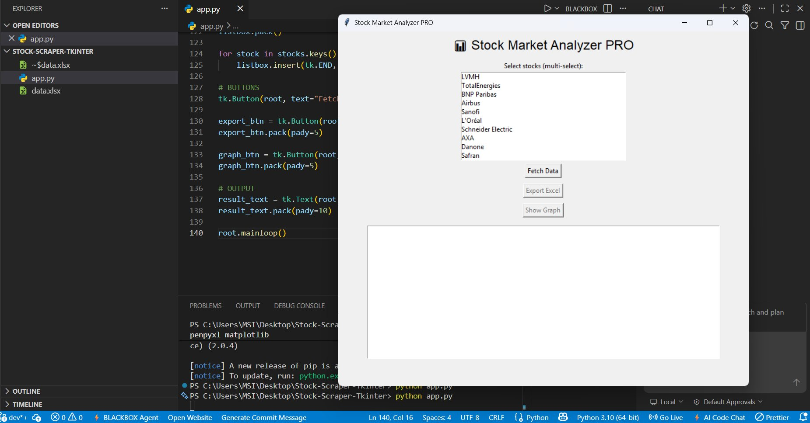
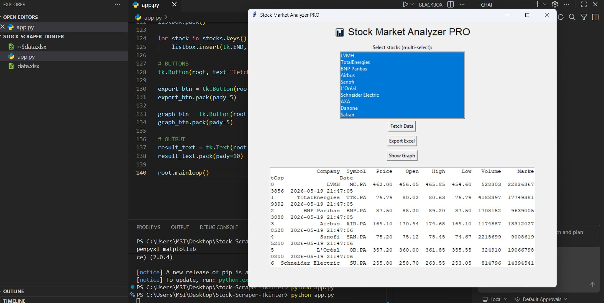
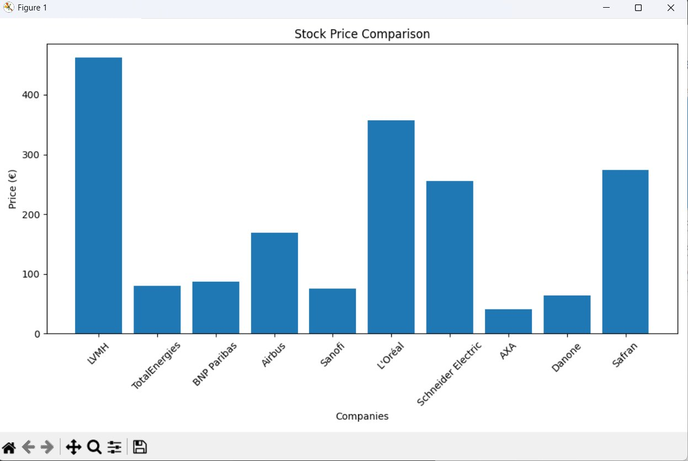
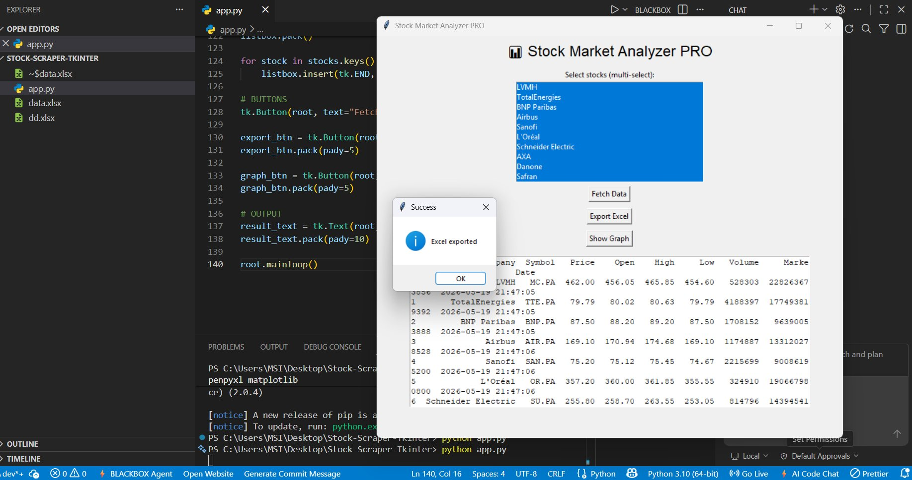
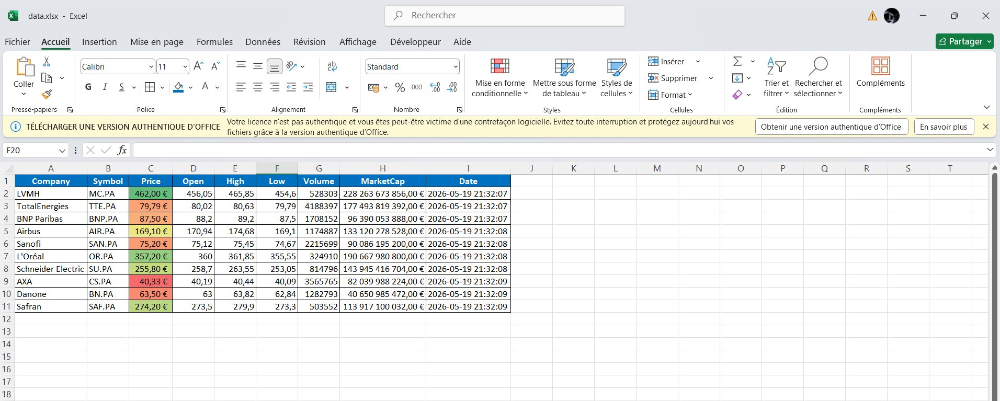

#  Stock Market Analyzer

> Application Python d'analyse de données financières en temps réel sur le marché boursier français.


---

## Présentation

**Stock Market Analyzer** est une application Python avec interface graphique permettant de :
- Sélectionner plusieurs actions du marché français (CAC 40)
- Récupérer leurs données financières en temps réel via Yahoo Finance
- Comparer leurs performances dans un tableau et un graphique
- Exporter les résultats au format Excel

Le projet met en œuvre un pipeline **ETL** complet (Extract → Transform → Load) en Python.

---

##  Captures d'écran

### Interface au lancement


### Données récupérées


### Graphique comparatif


### Export Excel



---

##  Fonctionnalités

- ✅ Sélection multiple parmi 10 actions françaises (LVMH, TotalEnergies, BNP Paribas, Airbus, Sanofi, L'Oréal, Schneider Electric, AXA, Danone, Safran)
- ✅ Récupération en temps réel : prix, ouverture, plus haut/bas, volume, capitalisation
- ✅ Tableau structuré dans l'interface
- ✅ Graphique comparatif en barres (matplotlib)
- ✅ Export Excel formaté (.xlsx)

---

##  Stack technique

| Composant | Technologie |
|-----------|-------------|
| Langage | Python 3.10 |
| Interface | Tkinter |
| API financière | yfinance |
| Manipulation | pandas |
| Visualisation | matplotlib |
| Export | openpyxl |

---

##  Architecture

```
Stock-Market-Analyzer/
│
├── app.py              # Application principale (Tkinter)
├── requirements.txt    # Dépendances Python
├── README.md           # Documentation du projet
├── data/               # Données exportées (.xlsx)
├── graphs/             # Graphiques générés
└── screenshots/        # Captures d'écran
```

---

##  Installation

### Prérequis
- Python 3.10 ou supérieur
- pip

### Installation des dépendances
```bash
pip install -r requirements.txt
```

Ou directement :
```bash
pip install yfinance pandas matplotlib openpyxl
```

### Lancement
```bash
python app.py
```

---

##  Pipeline ETL

1. **Extract** — Données récupérées via l'API Yahoo Finance (`yfinance`)
2. **Transform** — Nettoyage et structuration dans un `DataFrame` pandas
3. **Load** — Affichage GUI + export Excel + graphique matplotlib

---

##  Améliorations futures

- [ ] Analyse de l'évolution historique des prix
- [ ] Graphiques avancés (candlestick, courbes)
- [ ] Indicateurs techniques (RSI, MACD, moyennes mobiles)
- [ ] Connexion à une base de données (SQLite / PostgreSQL)
- [ ] Migration vers un dashboard web (Streamlit / Dash)
- [ ] Modèle de prédiction des prix (ML)

---

## 📄 Rapport détaillé

Un rapport PDF complet du projet est disponible : [`Rapport_Stock_Market_Analyzer.pdf`](./Rapport_Stock_Market_Analyzer.pdf)

---

##  Auteur

**Souheil** — Projet réalisé dans une démarche d'apprentissage et de démonstration de compétences en Python, data engineering et visualisation de données.

---

##  Licence

MIT
